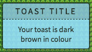

# ng-CleanToast

Simple toast service for Angular 1.x. Many toast services are built on sending $emit messages via $rootScope. This never felt right to me, so this design keeps all data within the service and it's related directive. 

Designed to be as light as possible so no built-in animations, and no outside dependencies other than AngularJS itself. 

Just toasts. 

### Installation
Available on Bower with `bower install ng-cleantoast`. 

### Usage
Add `bower_components/ng-cleantoast/dist/ng-cleantoast.min.js` to your main index.html along with Angular thus: 

````html
<head>
  <script src="bower_components/angularjs/angular.min.js"></script>
  <script src="bower_components/ng-cleantoast/dist/ng-cleantoast.min.js"></script>
</head>
````

Inject `ngCleanToast` to your module, and add `toasts` to any components that  will be create toasts:

````javascript
angular.module('demoApp', ['ngCleanToast'])

.controller('demoController', function(toasts) {
  // your code...
})
````

New toasts are created using: 

````javascript
toasts.create(type, title, text, timeout)
````

Built-in types are `info`, `warn`, `success` and `error`. They can be accessed via `toasts.types()` like `toasts.types('info')`. Custom types can be added with `toasts.addType('myNiceType')`. 



`title` and `text` are optional, but empty strings are needed if they are not required: 

````javascript
// Creates a new toast without a title and default timeout [see below]
toasts.create(toasts.type('info'), '', 'Hello')
````

`timeout` is the number of milliseconds (1000th of 1s) before the toast will disappear. This is optional and will default to 3000ms (3s) if not passed. You may also create sticky toasts that don't disappear until they are clicked on, by passing `toasts.sticky` (or any negative number) as the timeout value. 

Sticky toasts have their own style classes so you can make them stand out. See the examples below. 

#### Note about async calls
If the toast is called from an async fuction, the call must be wrapped in an $apply() function like so: 

````javascript
$scope.$apply(function() {
  toasts.create(type, title, text, timeout)
})
```` 

### Placement
You will need to tell the browser where to show toasts, by placing an element or attribute in a DIV or other tag:

````html
<ct-toasts></ct-toasts>

<!-- OR -->

<div ct-toasts></div>
````

#### Placement CSS
It's convention that a toast pops up above some other content, but not blocking anything important. In the demo, the `ct-toasts` element has fixed positioning and uses a very high `z-index`. 

If you follow this pattern, the initial `height` of `ct-toasts` should be `0`, and `max-height` should be no more than the view height (minus any `top`/`margin`/`padding` etc. to prevent unexpected scrolling). This example shows top-right placement of the toasts: 

````css
.ct-toasts {
  position: fixed;
  z-index: 1000;
  width: 200px;
  height: 0;
  top: 20px;
  right: 20px;
  max-height: calc(100vh - 20px); }
````

The `div` or `ct-toasts` element you create will be replaced with `div class="ct-toasts"`, and the toasts theselves render inside the `.ct-toasts` class like so (for toast type **info**): 

````HTML
<div class="ct-toasts">
  <div class="ct-toast ct-toast-info">
    <div class="ct-toast-title">Toast Title</div>
    <div class="ct-toast-text">Toast Text</div>
  </div>
</div>
````

Sticky toasts are ever-so-slightly different: 

````HTML
<div class="ct-toasts">
  <div class="ct-toast ct-sticky ct-toast-info">
    <div class="ct-toast-title ct-sticky">Toast Title</div>
    <div class="ct-toast-text ct-sticky">Toast Text</div>
  </div>
</div>
````

This allows you to style every element of the toast yourself. 

### Demo
There is an [example](https://underscoredotspace.github.io/ng-cleantoast/demo) with styles (the awful background is purely to enhance the opacity/shadow change on hover (sorry)). 

### Tests
With devDependencies installed, run `npm test`

### Issues/Pull requests
Please log any [issues, suggestions or questions](https://github.com/underscoredotspace/ng-cleantoast/issues). I aim to keep this as simple as possible, while providing the key features you expect of toasts. 

To set up an environment for development, clone the repo and `npm install`. Minify with `npm run grunt` before running tests (which are run against the minified version) and submitting a pull request. 